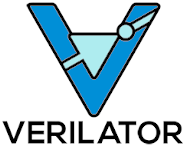
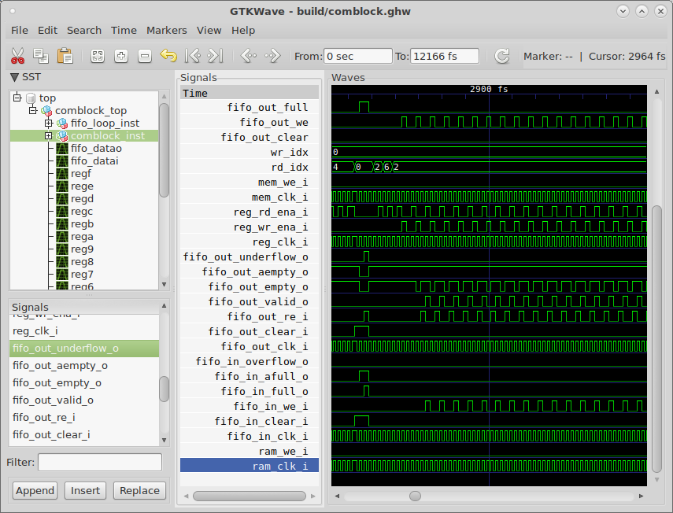
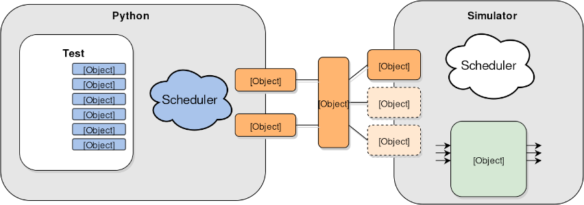
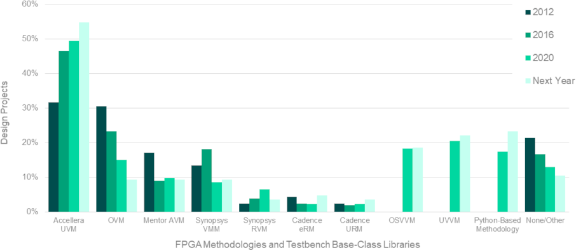

<!-- .slide: data-background="#145A32" -->

# FOSS for FPGA development

https://rodrigomelo9.github.io/FOSS-for-FPGAs/

by Rodrigo A. Melo - [CC BY 4.0](https://creativecommons.org/licenses/by/4.0/)

---
<!-- ###################################################################### -->
## Outline
<!-- ###################################################################### -->

* [Introduction](#/2)
* [General-purpose](#/5)
* [Simulation](#/12)
* [Testing and Verification](#/16)
* [Implementation](#/21)
* [Others](#/28)
* [Open Hardware](#/33)
* [Final words](#/38)

---
<!-- ###################################################################### -->
## Introduction
<!-- .slide: data-background="#581845" -->
<!-- ###################################################################### -->

[⌂](#/1)

---

### What is FOSS?

* Free (as freedom) and Open Source (you can access the source code) Software (programs).
* Solves the disambiguation between FREE and OPEN-SOURCE software.
* Anyone is freely licensed to USE, COPY, STUDY, and CHANGE the software.

|   |   |   |   |   |
|---|---|---|---|---|
|  |  |  |  |  |
|   |   |   |   |   |

---

### Why to use FOSS?

* **GENERAL**
  * Personal control, customization and freedom
  * Privacy and security
  * Low or no costs (solutions and support)
  * Quality, collaboration and efficiency
  * Flexibility and open-standars adherence
  * Innovation
* **SPECIFIC**
  * Vendor-independence
  * Lightweight (size and speed)

---
<!-- ###################################################################### -->
## General-purpose
<!-- .slide: data-background="#581845" -->
<!-- ###################################################################### -->

[⌂](#/1)

---

### Command-line

* Aka shell, terminal, console, bash...
* Most projects provide a CLI.
* Common for Linux/Unix distributions.
* Windows Subsytem for Linux (WSL).

---

### Git

* A distributed version control system.
* Created in 2005 by Linus Torvalds, for the development of the Linux kernel.
* Is the de facto standard for FOSS projects.
* Allows you to deal with a software repository, managing versions and multiple users.

|   |   |   |
|---|---|---|
|  |  |  |
|   |   |   |

----

#### Commands

```bash
git init
git clone <REPOSITORY>
```

```bash
git log <NONE_OR_FILEs_OR_PATHs>
git diff <NONE_OR_FILEs_OR_PATHs>
git status <NONE_OR_FILEs_OR_PATHs>
```

```bash
git add <DOT_OR_FILEs>
git commit <NONE_OR_FILEs_OR_PATHs>
git push
git pull
```


```bash
git checkout -b <NEW_BRANCH>
git checkout <BRANCH>
```

----

#### Clone the repository of this presentation

```bash
git clone https://github.com/rodrigomelo9/FOSS-for-FPGAs.git
```

---

### Docker

OS-level virtualization to deliver software in packages called containers, which are isolated one from another and bundle their own software, libraries and configuration files.


----

#### hdl/containers

https://hdl.github.io/containers/

* `hdlc/sim:osvb` (GHDL, Verilator, cocotb, OSVVM and VUnit)
* `hdlc/impl` (nextpnr-ice40, nextpnr-ecp5, nextpnr-generic, icestorm and prjtrellis)
* `hdlc/prog` (icestorm, openocd)

----

#### Examples

```bash
$ docker run --rm hdlc/sim:osvb ghdl -v
GHDL 2.0.0-dev (v1.0.0-252-gc14fc372) [Dunoon edition]
 Compiled with GNAT Version: 8.3.0
 llvm code generator
Written by Tristan Gingold.
```

```bash
$ docker run --rm hdlc/impl yosys --version
Yosys 0.9+4052 (git sha1 5c1e6a0e, clang 7.0.1-8+deb10u2 -fPIC -Os)
```

---

### Continuous integration (CI)

Is to automatically perform an action based on a repository event (push, merge, cron, etc).
* **Continuous Integration:** run linters, unit and/or integration tests, Hardware-in-the loop simulation.
* **Continuous Delivery:** build binaries, documentation, packages, etc.
* **Continuous Deployment:** build and install in production.

---

### Make

* Is a build automation tool.
* A Makefile contains a set of directives (targets, dependencies and rules) which are used by make to generate a target/goal.
* It works upon the principle that files only needs to be recreated if their dependencies are newer than the file being re/created.
* There are other newer tools such as CMake and Scons, but make is definitively the building tool, and sometimes part of the execution, in the FPGA ecosystem.

---

### Python

* Is an interpreted, high-level and general-purpose programming language (one of the most used in general, and the main in certain fields such as Machine/Deep Learning).
* A lot of its libraries are written in C (performance).
* Easy to read and learn.
* Most FOSS FPGA tools are written in Python, or C/C++ with a Python binding/wrapper.
* There are several HDL languages based on Python.
* Is also being used as verification language.

---
<!-- ###################################################################### -->
## Simulation
<!-- .slide: data-background="#581845" -->
<!-- ###################################################################### -->

[⌂](#/1)

---

### VHDL simulator

|   |   |
|---|---|
|  | Analyzer, compiler, simulator and (experimental) synthesizer for VHDL |
|   |   |

* Full support for IEEE 1076 standard 1987, 1993, 2002 and partial for 2008.
* It generates binaries to perform a simulation.
* Can dump waveforms to VCD or GHW (recommended for VHDL) files.

---

### Verilog simulators

|   |   |
|---|---|
|  | IEEE-1364 simulator</br>It generates an intermediate file format wich is then interpreted |
|   |   |

|   |   |
|---|---|
| Verilog/SystemVerilog simulator</br>Compiles into multithreaded C++</br>Performs lint code-quality checks |  |
|   |   |

---

### Waveforms viewer

|   |   |
|---|---|
| A fully featured wave viewer which reads</br>LXT, LXT2, VZT, FST, and GHW files as</br>well as standard Verilog VCD/EVCD |  |
|   |   |

---
<!-- ###################################################################### -->
## Testing and Verification
<!-- .slide: data-background="#581845" -->
<!-- ###################################################################### -->

[⌂](#/1)

---

### HDL based frameworks/methodologies

* **OSVVM:** Open Source VHDL Verification Methodology
* **UVVM:** Universal VHDL Verification Methodology
* **VUnit:** unit testing framework for VHDL/SystemVerilog
* **SVUnit:** unit testing framework for Verilog/SystemVerilog

|   |   |   |   |
|---|---|---|---|
|  |  |  |  |
|   |   |   |   |

---

### Python based testbenches


* **cocotb:** Coroutine Co-simulation Test Bench
* A coroutine based cosimulation library for writing VHDL and Verilog testbenches in Python
* Supported simulators: ghdl, iverilog, verilator, Synopsys VCS, Aldec Riviera-PRO, Aldec Active-HDL, Mentor Questa, Mentor ModelSim, Cadence Incisive, Cadence Xcelium, Tachyon DA CVC.

----

#### How does cocotb work?



**Source:** https://docs.cocotb.org/en/stable

---

### Formal verification

The act of proving the correctness of intended algorithms underlying a system with respect to a certain formal specification or property, using formal methods of mathematics (assumptions and assertions).
* **SymbiYosys (sby):** front-end driver program for Yosys-based formal hardware verification flows.
* Supports Verilog (free), VHDL and SystemVerilog (through verific with a license).


---

### Verification trends



**Source:** [ The 2020 Wilson Research Group Functional Verification Study](https://blogs.sw.siemens.com/verificationhorizons/2020/12/16/part-6-the-2020-wilson-research-group-functional-verification-study/)

---
<!-- ###################################################################### -->
## Implementation
<!-- .slide: data-background="#581845" -->
<!-- ###################################################################### -->

[⌂](#/1)

---

### HDL-to-Bitstream

---

### Languages

---

### Synthesis

----

#### Yosys

----

#### GHDL

---

### Place & Route

---

### Bitstream Generation

---

### Programming

---
<!-- ###################################################################### -->
## Others
<!-- .slide: data-background="#581845" -->
<!-- ###################################################################### -->

[⌂](#/1)

---

### Project Managers

---

### Libraries, Collections, IP Cores

---

### Softcores

----

#### Legacy

----

#### RISC V

---

### Miscellaneous

----

#### TerosHDL

----

#### Icestudio

---
<!-- ###################################################################### -->
## Open Hardware
<!-- .slide: data-background="#581845" -->
<!-- ###################################################################### -->

[⌂](#/1)

---

### Kicad

---

### Some ICE40 based boards

---

### Some ECP5 based boards

---

### Some other boards

---
<!-- ###################################################################### -->
## Final words
<!-- .slide: data-background="#581845" -->
<!-- ###################################################################### -->

[⌂](#/1)

---

### How to be updated?

----

#### Organizations

----

#### People

----

#### hdl/awesome
