<!-- .slide: data-background="#145A32" -->

# FOSS for FPGA development

[rodrigomelo9.github.io/FOSS-for-FPGAs](https://rodrigomelo9.github.io/FOSS-for-FPGAs/)

**Rodrigo A. Melo**, Unai Martinez-Corral

[Creative Commons Attribution 4.0 International](https://creativecommons.org/licenses/by/4.0/)

---
<!-- ###################################################################### -->
## Outline
<!-- ###################################################################### -->

* [Introduction](#/2)
* [Work environment](#/5)
* [Simulation](#/12)
* [Testing and Verification](#/16)
* [Implementation](#/23)
* [Others](#/30)
* [Open Hardware](#/35)
* [Final words](#/41)

---
<!-- ###################################################################### -->
## Introduction
<!-- .slide: data-background="#581845" -->
<!-- ###################################################################### -->

[⌂](#/1)

---

### What is FOSS?

* Free/Libre and Open Source Software
* Users have the freedom to **run**, **copy**, **distribute**, **study**, **change** and **improve** the software

|   |   |   |
|---|---|---|
|    |  | 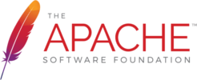 |
|  |              |        |
|   |   |   |

---

### Why use FOSS?

* Freedom matters!
* Flexibility and Independence
* Knowledge sharing
* Innovation
* Privacy and security
* And [several others](https://www.softwarefreedomday.org/about/why-foss)

---
<!-- ###################################################################### -->
## Work environment
<!-- .slide: data-background="#581845" -->
<!-- ###################################################################### -->

[⌂](#/1)

---

### Command-line

* Aka shell, terminal, console, bash...
* Most projects provide a CLI.
* Common on Linux/Unix distributions.
* On Windows:
  * [MSYS2](https://www.msys2.org/) ([hdl.github.io/MINGW-packages](https://hdl.github.io/MINGW-packages/)).
  * Windows Subsytem for Linux (WSL).

---

### Git

* A distributed version control system.
* Created in 2005 by Linus Torvalds, for the development of the Linux kernel.
* De facto standard for FOSS projects.
* Allows dealing with a software repository and managing versions in multi-user workflows.

|   |   |   |
|---|---|---|
|  |  |  |
|   |   |   |

----

#### Commands

```bash
git init
git clone <REPOSITORY>
```

```bash
git log <NONE_OR_FILEs_OR_PATHs>
git diff <NONE_OR_FILEs_OR_PATHs>
git status <NONE_OR_FILEs_OR_PATHs>
```

```bash
git add <DOT_OR_FILEs>
git commit <NONE_OR_FILEs_OR_PATHs>
git push
git pull
```

```bash
git checkout -b <NEW_BRANCH>
git checkout <BRANCH>
```

[try.github.io: Resources to learn Git](https://try.github.io/)

---

### Docker

OS-level virtualization to deliver software in packages called **containers**.


Containers are isolated one from another and bundle their own software, libraries and configuration files.

----

#### hdl/containers

[hdl.github.io/containers](https://hdl.github.io/containers/)

* **hdlc/sim:osvb** (GHDL, Verilator, cocotb, OSVVM and VUnit)
* **hdlc/impl** (GHDL, Yosys, nextpnr-ice40, nextpnr-ecp5, nextpnr-generic, icestorm and prjtrellis)
* **hdlc/prog** (icestorm, openocd)

----

#### Example
<!-- .slide: data-background="#D4AC0D" -->

Install Docker (instructions [here](https://github.com/rodrigomelo9/FOSS-for-FPGAs#docker-installation)) and check the latest versions of GHDL and Yosys at [hdl/containers](https://hdl.github.io/containers/)
```bash
$ docker run --rm hdlc/ghdl:yosys ghdl -v
$ docker run --rm hdlc/ghdl:yosys yosys --version
```

---

### Continuous Integration/Delivery/Deployment (CI/CD)

Automatically executing actions based on repository events (push, merge, cron, etc).

* **Integration:** run linters, unit and/or integration tests, Hardware-in-the loop simulation.
* **Delivery:** build binaries, documentation, packages, etc.
* **Deployment:** build and install in production.

----

#### Example
<!-- .slide: data-background="#D4AC0D" -->

```yaml
name: 'examples'

on:
  push:

jobs:
  examples:
    name: 'Running examples'
    runs-on: ubuntu-latest
    steps:
    - uses: actions/checkout@v2
      with:
        submodules: true
        fetch-depth: 0
    - name: Pull container images
      run: |
        docker pull hdlc/sim:osvb
        docker pull hdlc/ghdl:yosys
        docker pull hdlc/nextpnr:ice40
        docker pull hdlc/icestorm
    - run: make -C examples/ghdl sim
    - run: make -C examples/ghdl syn
    - run: make -C examples/impl
```

**Source:** [rodrigomelo9/FOSS-for-FPGAs/.github/workflows/examples.yml](https://github.com/rodrigomelo9/FOSS-for-FPGAs/blob/main/.github/workflows/examples.yml)

---

### Make

* A build automation tool: a Makefile contains a set of directives (targets, dependencies and rules) which are used by `make` for generating a target/goal.
* It works upon the principle that files only need to be recreated if their dependencies are newer than the file being re/created.
* There are newer alternatives (such as CMake, Scons, Ninja, etc.), but `make` is the most used automation tool in the FPGA ecosystem.

---

### Python

* An interpreted, high-level and general-purpose programming language.
* One of the most used and fastest growing languages in all fields, especially in scientific computing and Machine/Deep Learning.
* Many of its libraries are written in C/C++ (performance).
* Most FOSS FPGA tools are written in Python, or C/C++ with a Python binding/wrapper.
* There are several HDL languages based on Python.
* It's also being used as a verification language.

---
<!-- ###################################################################### -->
## Simulation
<!-- .slide: data-background="#581845" -->
<!-- ###################################################################### -->

[⌂](#/1)

---

### VHDL simulator

|   |   |
|---|---|
|  | Analyzer, compiler, simulator and (experimental) synthesizer for VHDL |
|   |   |

* Full support for IEEE 1076 standard 1987, 1993, 2002 and partial for 2008.
* It can generate executable binary models of the VHDL design, for (co-)simulation.
* It can dump waveforms to multiple formats: VCD, FST or GHW (recommended for VHDL).

---

### Verilog simulators

|   |   |
|---|---|
|  | IEEE-1364 simulator</br>It generates an intermediate file format wich is then interpreted |
|   |   |

|   |   |
|---|---|
| Verilog/SystemVerilog simulator</br>Compiles into multithreaded C++</br>Performs lint code-quality checks |  |
|   |   |

---

### Waveform viewer

|   |   |
|---|---|
| A fully featured wave viewer which reads</br>LXT, LXT2, VZT, FST, and GHW files as</br>well as standard Verilog VCD/EVCD |  |
|   |   |

---

### Example
<!-- .slide: data-background="#D4AC0D" -->

```bash
git clone https://github.com/rodrigomelo9/FOSS-for-FPGAs.git
cd FOSS-for-FPGAs/examples/ghdl
make sim
# Must ends with:
# 0 ns --> Start of test
# 380 ns-> End of test
make syn
# Check the content of _build/counter_syn.v[hdl]
make view
# Check waveforms
make clean
```

---
<!-- ###################################################################### -->
## Testing and Verification
<!-- .slide: data-background="#581845" -->
<!-- ###################################################################### -->

[⌂](#/1)

---

### HDL based frameworks/methodologies

* **OSVVM:** Open Source VHDL Verification Methodology
* **UVVM:** Universal VHDL Verification Methodology
* **SVUnit:** unit testing framework for Verilog/SystemVerilog

|   |   |   |
|---|---|---|
|  |  |  |
|   |   |   |

---

### Python aided framework


* **VUnit:** unit testing framework for VHDL/SystemVerilog.
* A Python build and simulator manager together with VHDL libraries.
* Supported simulators: GHDL, Aldec Riviera-PRO, Aldec Active-HDL, Mentor Questa, Mentor ModelSim, Cadence Incisive, Cadence Xcelium.

---

### Python based testbenches


* **cocotb:** Coroutine Co-simulation Test Bench.
* A coroutine based cosimulation library for writing VHDL and Verilog testbenches in Python, through VPI/VHPI interfaces.
* Supported simulators: GHDL, iverilog, verilator, Synopsys VCS, Aldec Riviera-PRO, Aldec Active-HDL, Mentor Questa, Mentor ModelSim, Cadence Incisive, Cadence Xcelium, Tachyon DA CVC.

----

#### How does cocotb work?


**Source:** https://docs.cocotb.org/en/stable

---

### Open Source Verification Bundle (OSVB)


[umarcor.github.io/osvb](https://umarcor.github.io/osvb/)

---

### Formal verification

Using formal mathematic methods (assumptions and assertions) for proving the correctness of intended algorithms/designs.

* **SymbiYosys (sby):** front-end driver program for Yosys-based formal hardware verification flows.
* Supports Verilog (free), VHDL and SystemVerilog (through verific with a license).


----

#### Property Specification Language (PSL)

* GHDL provides VHDL support for Yosys/SymbiYosys for free, through ghdl-yosys-plugin.
* Moreover, PSL is supported.

---

### Verification trends


**Source:** [ The 2020 Wilson Research Group Functional Verification Study](https://blogs.sw.siemens.com/verificationhorizons/2020/12/16/part-6-the-2020-wilson-research-group-functional-verification-study/) - SIEMENS

See also [GitHub Facts About the HDL Industry](https://larsasplund.github.io/github-facts/)

---
<!-- ###################################################################### -->
## Implementation
<!-- .slide: data-background="#581845" -->
<!-- ###################################################################### -->

[⌂](#/1)

---

### HDL-to-Bitstream

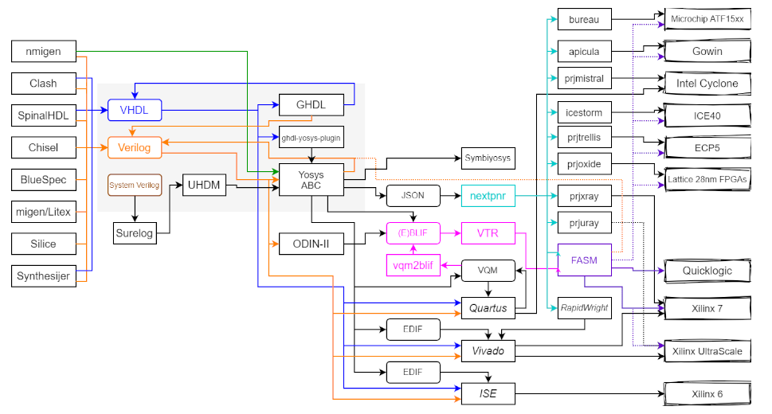

**Source:** [hdl/awesome#98](https://github.com/hdl/awesome/issues/98)

---

### Languages

|   |   |
|---|---|
|  | * nMigen</br>* migen</br> * MyHDL                       |
|    | * SpinalHDL</br>* Chisel                                |
| Others                             | * Bluespec</br>* Silice</br> * Synthesijer</br> * Clash |
|   |   |

---

### Synthesis

Converting an abstract specification of a circuit (being an HDL a common input) into a design implementation in terms of the basic blocks supported by the chosen technology (being a netlist the output).

----

#### Yosys

* A FOSS framework for RTL synthesis tools.
* It currently has extensive Verilog-2005 support and provides a basic set of synthesis algorithms for various application domains.
* It was the first usable FOSS synthesizer targeting commercially available devices.
* Supports devices from Lattice (iCE40 and ECP5), Xilinx (Series 7, Ultrascale, and others), Gowin, Achronix, Intel, Microsemi, etc.


----

#### GHDL

* Analyzer, compiler, simulator and (experimental) synthesizer for VHDL
* Generates a generic (technology independent) synthesized VHDL (and recently, also Verilog)

* **ghdl-yosys-plugin:** VHDL synthesis, based on GHDL and Yosys.


---

### Place & Route

|   |   |
|---|---|
| 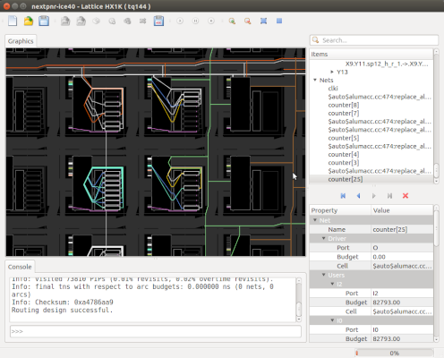 | The stage where the logic elements are placed and interconnected on the FPGA |
|   |   |

* NextPnR (Arachne-pnr)
* VPR, part of Verilog-to-Routing (VTR)

---

### Bitstream Generation

|   |   |
|---|---|
| Packing the result</br>of the P&R into an</br>FPGA configuration</br>file | 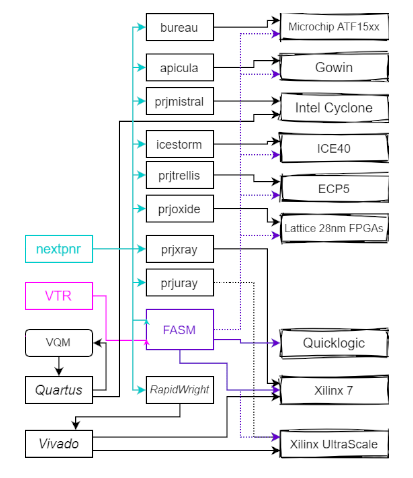 |
|   |   |

<!--http://www.fabienm.eu/flf/materiel/liberation-des-fpga/-->

---

### Programming

* **OpenOCD:** **Open** **O**n-**C**hip **D**ebugging, In-System Programming and Boundary-Scan Testing
* **UrJTAG:** universal JTAG library, server and tools
* **iceprog:** programmer of the IceStorm project (FTDI-based programmers)
* **ecpprog:** programmer for the Lattice ECP5 series  (FTDI-based programmers)
* **openFPGALoader:** universal utility for programming FPGA
* **dfu-util:** **D**evice **F**irmware **U**pgrade **Uti**lities (USB)

----

#### Example
<!-- .slide: data-background="#D4AC0D" -->

```bash
# From FOSS-for-FPGAs/examples/ghdl
cd ../impl
make
make prog
```

---
<!-- ###################################################################### -->
## Others
<!-- .slide: data-background="#581845" -->
<!-- ###################################################################### -->

[⌂](#/1)

---

### Project Managers

* **HDLmake:** tool for generating multi-purpose Makefiles for FPGA projects
* **edalize:** a Python Library for interacting with EDA tools (was part of FuseSoC, now its build backend).
* **PyFPGA:** A Python package to use FPGA development tools programmatically

|   |   |   |   |
|---|---|---|---|
| 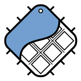 | Synthesis</br>Implementation</br>Bitstream</br>Programming | ISE, Vivado</br>Quartus</br>Libero-SoC</br>FOSS | **Helpers**</br>hdl2bit</br>prj2bit</br>bitprog |
|   |   |   |   |

----

#### Demo
<!-- .slide: data-background="#D4AC0D" -->

```bash
git clone https://github.com/PyFPGA/pyfpga.git
cd pyfpga
sudo pip3 install -e .
fpga-hdl2bit --tool openflow -p hx4k-tq144 \
    -f hdl/blinking.vhdl,examples \
    -f hdl/examples_pkg.vhdl,examples \
    -f examples/openflow/edu-ciaa-fpga.pcf \
    hdl/top.vhdl
fpga-bitprog --tool openflow temp/openflow.bit
```

---

### Libraries, Collections, IP Cores

* **PoC (Pile of Cores Library):** a library of free, open-source and platform independent IP cores.
* **FuseSoC:** package manager and build abstraction tool (edalize) for FPGA/ASIC development.
* **Litex:** a Migen/MiSoC based SoC builder to easily create Cores/SoCs
* **OpenCores** and **LibreCores:** collections of IPs.
* Several FOSS projects at GitHub and GitLab.

&nbsp;&nbsp;&nbsp;&nbsp;&nbsp;&nbsp;&nbsp;&nbsp;

---

### Softcores

----

#### Legacy

**Leon 3** (Gaisler)
* 32-bit VHDL processor compliant with the SPARC V8 architecture
* GNU GPL license for research and education
* Part of the GRLIB

**OpenRISC**
* Specification OpenRISC 1000 (32/64 bits)
* The flagship implementation, the OR1200, is written in Verilog
* Part of OpenRISC Reference Platform System-on-Chip (ORPSoC)

----

#### RISC V

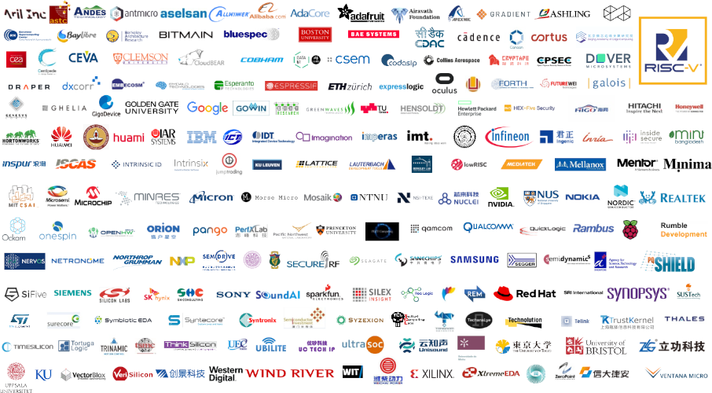

---

### Miscellaneous

----

#### TerosHDL

|   |   |
|---|---|
| 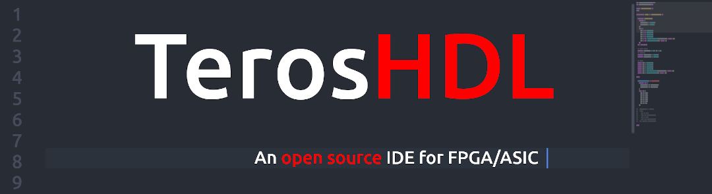 | Atom & VS code</br></br>Suports:</br>GHDL, VUnit & GTKwave</br></br>Coming soon:</br>Verilator, cocotb, edalize |
|   |   |

----

#### Icestudio


[FPGAwars/icestudio](https://github.com/FPGAwars/icestudio)

[juanmard/icestudio](https://github.com/juanmard/icestudio) ([nightly](https://github.com/juanmard/icestudio/releases/tag/nightly) builds)

---
<!-- ###################################################################### -->
## Open Hardware
<!-- .slide: data-background="#581845" -->
<!-- ###################################################################### -->

[⌂](#/1)

---

### Kicad


---

### Some ICE40 based boards

|   |   |   |
|---|---|---|
| Fomu</br>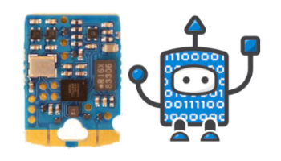 | iCEBreaker</br> | iCESugar</br>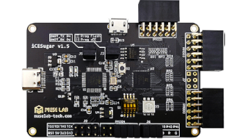 |

|   |   |
|---|---|
| TinyFPGA BX</br> | EDU CIAA FPGA</br> |

---

### Some ECP5 based boards

|   |   |   |
|---|---|---|
| ULX3S</br> |OrangeCrab</br>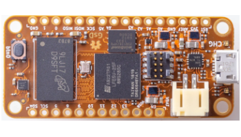 | TinyFPGA EX</br> |
|   |   |   |

---

### Some EOS S3 based boards

|   |   |
|---|---|
| Qomu</br> | Quickfeather</br>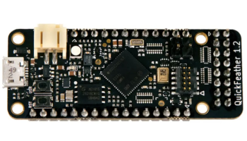 |
|   |   |

---

### HDL/constraints

* [hdl/constraints](https://github.com/hdl/constraints): constraint files for Hardware Description Language (HDL) designs targeting FPGA boards.
* [hdl.github.io/awesome/boards](https://hdl.github.io/awesome/boards/): list of FPGA developments boards.

---
<!-- ###################################################################### -->
## Final words
<!-- .slide: data-background="#581845" -->
<!-- ###################################################################### -->

[⌂](#/1)

---

### How to be updated?

----

#### Projects - Organizations

&nbsp;&nbsp;&nbsp;&nbsp;


&nbsp;&nbsp;&nbsp;&nbsp;

----

#### People

|   |   |   |
|---|---|---|
|    | [mithro](https://github.com/mithro)          | Tim 'mithro' Ansell                      |
|  | [mithro](https://twitter.com/mithro)         |  |
|    | [umarcor](https://github.com/umarcor)        | Unai Martinez-Corral                     |
|  | [unaimarcor](https://twitter.com/unaimarcor) |      |

----

#### hdl/awesome

|   |   |
|---|---|
|  |  |
|   |   |

[hdl.github.io/awesome](https://hdl.github.io/awesome)

<!-- ---- -->

<!-- #### FPGArgentina -->

<!--  -->

<!-- [rodrigomelo9.gitlab.io/fpgargentina](https://rodrigomelo9.gitlab.io/fpgargentina) -->

---
<!-- ###################################################################### -->
# Questions?
<!-- .slide: data-background="#1F618D" -->
<!-- ###################################################################### -->

|   |   |
|---|---|
|  | [rodrigomelo9](https://github.com/rodrigomelo9) |
|  | [rodrigomelo9ok](https://twitter.com/rodrigomelo9ok) |
|  | [rodrigoalejandromelo](https://www.linkedin.com/in/rodrigoalejandromelo/) |
|   |   |
