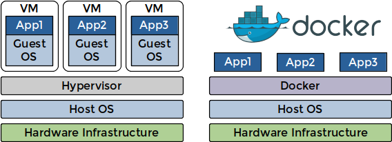

<!-- .slide: data-background="#145A32" -->

# FOSS for FPGA development

https://rodrigomelo9.github.io/FOSS-for-FPGAs/

by Rodrigo A. Melo - [CC BY 4.0](https://creativecommons.org/licenses/by/4.0/)

---
<!-- ###################################################################### -->
## Outline
<!-- ###################################################################### -->

* [Introduction](#/2)
* [General-purpose](#/5)
* [Simulation](#/12)
* [Testing and Verification](#/16)
* [Implementation](#/21)
* [Others](#/28)
* [Open Hardware](#/33)
* [Final words](#/38)

---
<!-- ###################################################################### -->
## Introduction
<!-- .slide: data-background="#581845" -->
<!-- ###################################################################### -->

[⌂](#/1)

---

### What is FOSS?

* Free (as freedom) and Open Source (you can access the source code) Software (programs).
* Solves the disambiguation between FREE and OPEN-SOURCE software.
* Anyone is freely licensed to USE, COPY, STUDY, and CHANGE the software.

&nbsp;&nbsp;&nbsp;
&nbsp;&nbsp;&nbsp;
&nbsp;&nbsp;&nbsp;
&nbsp;&nbsp;&nbsp;


---

### Why to use FOSS?

* **GENERAL**
  * Personal control, customization and freedom
  * Privacy and security
  * Low or no costs (solutions and support)
  * Quality, collaboration and efficiency
  * Flexibility and open-standars adherence
  * Innovation
* **SPECIFIC**
  * Vendor-independence
  * Lightweight (size and speed)

---
<!-- ###################################################################### -->
## General-purpose
<!-- .slide: data-background="#581845" -->
<!-- ###################################################################### -->

[⌂](#/1)

---

### Command-line

* Aka shell, terminal, console, bash...
* Most projects provide a CLI.
* Common for Linux/Unix distributions.
* Windows Subsytem for Linux (WSL).

---

### Git

* A distributed version control system.
* Created in 2005 by Linus Torvalds, for the development of the Linux kernel.
* Is the de facto standard for FOSS projects.
* Allows you to deal with a software repository, managing versions and multiple users.

&nbsp;&nbsp;&nbsp;
&nbsp;&nbsp;&nbsp;
&nbsp;&nbsp;&nbsp;

----

#### Commands

```bash
git init
git clone <REPOSITORY>
```

```bash
git log <NONE_OR_FILEs_OR_PATHs>
git diff <NONE_OR_FILEs_OR_PATHs>
git status <NONE_OR_FILEs_OR_PATHs>
```

```bash
git add <DOT_OR_FILEs>
git commit <NONE_OR_FILEs_OR_PATHs>
git push
git pull
```


```bash
git checkout -b <NEW_BRANCH>
git checkout <BRANCH>
```

----

#### Clone the repository of this presentation

```bash
git clone https://github.com/rodrigomelo9/FOSS-for-FPGAs.git
```

---

### Docker

OS-level virtualization to deliver software in packages called containers, which are isolated one from another and bundle their own software, libraries and configuration files.



----

#### hdl/containers

----

#### Example

---

### Continuous integration (CI)

---

### Make

---

### Python

---
<!-- ###################################################################### -->
## Simulation
<!-- .slide: data-background="#581845" -->
<!-- ###################################################################### -->

[⌂](#/1)

---

### VHDL simulator

---

### Verilog simulators

---

### Waveforms viewer

---
<!-- ###################################################################### -->
## Testing and Verification
<!-- .slide: data-background="#581845" -->
<!-- ###################################################################### -->

[⌂](#/1)

---

### HDL based frameworks/methodologies

---

### Python based testbenches

---

### Formal verification

---

### Verification trends

---
<!-- ###################################################################### -->
## Implementation
<!-- .slide: data-background="#581845" -->
<!-- ###################################################################### -->

[⌂](#/1)

---

### HDL-to-Bitstream

---

### Languages

---

### Synthesis

----

#### Yosys

----

#### GHDL

---

### Place & Route

---

### Bitstream Generation

---

### Programming

---
<!-- ###################################################################### -->
## Others
<!-- .slide: data-background="#581845" -->
<!-- ###################################################################### -->

[⌂](#/1)

---

### Project Managers

---

### Libraries, Collections, IP Cores

---

### Softcores

----

#### Legacy

----

#### RISC V

---

### Miscellaneous

----

#### TerosHDL

----

#### Icestudio

---
<!-- ###################################################################### -->
## Open Hardware
<!-- .slide: data-background="#581845" -->
<!-- ###################################################################### -->

[⌂](#/1)

---

### Kicad

---

### Some ICE40 based boards

---

### Some ECP5 based boards

---

### Some other boards

---
<!-- ###################################################################### -->
## Final words
<!-- .slide: data-background="#581845" -->
<!-- ###################################################################### -->

[⌂](#/1)

---

### How to be updated?

----

#### Organizations

----

#### People

----

#### hdl/awesome
