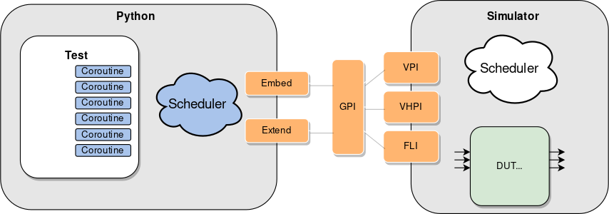

<!-- .slide: data-background="#145A32" -->

# cocotb tutorial

#### (cocotb 1.6, python 3.6+)

[github.com/rodrigomelo9/FOSS-for-FPGAs](https://github.com/rodrigomelo9/FOSS-for-FPGAs)

**Rodrigo A. Melo**

[Creative Commons Attribution 4.0 International](https://creativecommons.org/licenses/by/4.0/)

---
<!-- ###################################################################### -->
## Introduction
<!-- ###################################################################### -->


cocotb is a **CO**routine based **CO**simulation **T**est**B**ench environment for verifying
VHDL and (System)Verilog RTL using Python.

* **Repo:** [github.com/cocotb/cocotb](https://github.com/cocotb/cocotb)
* **Docs:** [docs.cocotb.org/en/stable](https://docs.cocotb.org/en/stable)

----

### A Brief History of cocotb

* 2012: started by Chris Higgs and Stuart Hodgson (Potential Ventures).
* 2013: Open sourced (Jun). cocotb 0.1 (Jul), 0.2 (Jul) and 0.3 (Sep).
* 2014: cocotb 0.4 (Feb).
* 2015: cocotb 1.0 (Feb).
* 2018: FOSSi Foundation.
* 2019: cocotb 1.1 (Jan), 1.2 (Jul).
* 2020: cocotb 1.3 (Jan), 1.4 (Jul).
* 2021: cocotb 1.5 (Mar), 1.6 (Oct).
* cocotb 2.0 under development.

---
<!-- ###################################################################### -->
## How does it work?
<!-- ###################################################################### -->



**Source:** [docs.cocotb.org/en/stable](https://docs.cocotb.org/en/stable)

---
<!-- ###################################################################### -->
## Installation
<!-- ###################################################################### -->

##### Debian based systems

```bash
apt install make gcc g++ python3 python3-dev python3-pip
pip3 install cocotb
```

**Others:** [docs.cocotb.org/en/stable/install.html](https://docs.cocotb.org/en/stable/install.html)

##### Supported simulators

[Icarus Verilog](https://github.com/steveicarus/iverilog),
[Verilator](https://github.com/verilator/verilator),
Synopsys VCS,
Aldec Riviera-PRO and Active-HDL,
Mentor Questa and ModelSim,
Cadence Incisive and Xcelium,
[GHDL](https://github.com/ghdl/ghdl),
Tachyon [CVC](https://github.com/cambridgehackers/open-src-cvc).

---
<!-- ###################################################################### -->
## Elements of a simulation
<!-- ###################################################################### -->

* One (top-level) or more HDL files (the DUT).
* A Python script with one or more individual tests.
* A `Makefile`

---
<!-- ###################################################################### -->
## Makefile
<!-- ###################################################################### -->

```
SIM = <SIMULATOR_NAME>
TOPLEVEL_LANG = <verilog|vhdl>
VERILOG_SOURCES += <LIST_OF_VERILOG_SOURCES>
VHDL_SOURCES += <LIST_OF_VHDL_SOURCES>
VHDL_SOURCES_<LIB> += <LIST_OF_VHDL_SOURCES_IN_LIB>
TOPLEVEL = <TOP_LEVEL_NAME>
MODULE = <PYTHON_SCRIPT_NAME_WITHOUT_PY_EXTENSION>
include $(shell cocotb-config --makefiles)/Makefile.sim
```

##### SIMULATOR_NAME

`icarus`, `verilator`, `vcs`, `riviera`, `activehdl`, `questa`, `modelsim`, `ius`, `xcelium`, `ghdl` and `cvc`

----

### Verilog sources example

```
PATH = ../hdl/vlog
TOPLEVEL_LANG = verilog
VERILOG_SOURCES  = $(PATH)/file_1.v $(PATH)/file_2.v
VERILOG_SOURCES += $(PATH)/file_3.v $(PATH)/top.v
TOPLEVEL = top
```

### VHDL sources example

```
PATH = ../hdl/vhdl
TOPLEVEL_LANG = vhdl
VHDL_SOURCES_lib1  = $(PATH)/file_a.vhdl $(PATH)/file_b.vhdl
VHDL_SOURCES_lib2  = $(PATH)/file_c.vhdl $(PATH)/file_d.vhdl
VHDL_SOURCES_lib2 += $(PATH)/file_e.vhdl
VHDL_SOURCES  = $(PATH)/file_1.vhdl $(PATH)/file_2.vhdl
VHDL_SOURCES += $(PATH)/file_3.vhdl $(PATH)/top.vhdl
TOPLEVEL = top
```

----

### Some Other Makefile options

* **RANDOM_SEED**: to recreate a previous test.
* **COCOTB_ENABLE_PROFILING**: of the Python portion of cocotb.
* **COVERAGE**: to report Python coverage data (also HDL coverage for some simulators).
* **TESTCASE**: specify a particular test function.
* **GUI**: enable this mode if supported.
* **COMPILE_ARGS**, **SIM_ARGS**, **EXTRA_ARGS**: arguments or flags to pass to the compile, execution or boths phases of the simulator.
* **More**: [docs.cocotb.org/en/stable/building.html](https://docs.cocotb.org/en/stable/building.html)

---
<!-- ###################################################################### -->
## Python Testbenches
<!-- ###################################################################### -->

```
import cocotb
from cocotb.<MODULE> import <CLASS>

@cocotb.test()
async def my_test1(dut):

@cocotb.test()
async def my_test2(dut):

async def my_coro1(dut):

async def my_coro2(dut):

def my_function():
```

<!--**More at:**-->
<!--* https://docs.cocotb.org/en/stable/library_reference.html-->
<!--* https://docs.cocotb.org/en/stable/coroutines.html-->

---
<!-- ###################################################################### -->
## How to run
<!-- ###################################################################### -->

```
make
```

```
make SIM=icarus
```

----

### Example output

----

### How to run with Docker

---
<!-- ###################################################################### -->
# Questions?
<!-- .slide: data-background="#1F618D" -->
<!-- ###################################################################### -->

|   |   |
|---|---|
|  | [rodrigomelo9](https://github.com/rodrigomelo9) |
|  | [rodrigomelo9ok](https://twitter.com/rodrigomelo9ok) |
|  | [rodrigoalejandromelo](https://www.linkedin.com/in/rodrigoalejandromelo/) |
|   |   |
