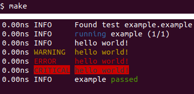
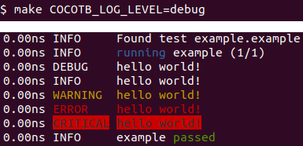

<!-- .slide: data-background="#145A32" -->

# cocotb tutorial

#### (cocotb 1.6, python 3.6+)

[github.com/rodrigomelo9/FOSS-for-FPGAs](https://github.com/rodrigomelo9/FOSS-for-FPGAs)

**Rodrigo A. Melo**

[Creative Commons Attribution 4.0 International](https://creativecommons.org/licenses/by/4.0/)

---
<!-- ###################################################################### -->
## Introduction
<!-- ###################################################################### -->


cocotb is a **CO**routine based **CO**simulation **T**est**B**ench environment for verifying
VHDL and (System)Verilog RTL using Python.

* **Repo:** [github.com/cocotb/cocotb](https://github.com/cocotb/cocotb)
* **Docs:** [docs.cocotb.org/en/stable](https://docs.cocotb.org/en/stable)

----

### A Brief History of cocotb

* 2012: started by Chris Higgs and Stuart Hodgson (Potential Ventures).
* 2013: Open sourced (BSD, Jun). cocotb 0.1 (Jul), 0.2 (Jul) and 0.3 (Sep).
* 2014: cocotb 0.4 (Feb).
* 2015: cocotb 1.0 (Feb).
* 2018: FOSSi Foundation.
* 2019: cocotb 1.1 (Jan), 1.2 (Jul).
* 2020: cocotb 1.3 (Jan), 1.4 (Jul).
* 2021: cocotb 1.5 (Mar), 1.6 (Oct).
* cocotb 1.7/2.0 under development.

----

### How does it work?


**Source:** [docs.cocotb.org/en/stable](https://docs.cocotb.org/en/stable)

----

### Installation (Debian based systems)

```bash
apt install make gcc g++ python3 python3-dev python3-pip
pip3 install cocotb
```

**Others:** [docs.cocotb.org/en/stable/install.html](https://docs.cocotb.org/en/stable/install.html)

### Supported simulators

[Icarus Verilog](https://github.com/steveicarus/iverilog),
[Verilator](https://github.com/verilator/verilator),
Synopsys VCS,
Aldec Riviera-PRO and Active-HDL,
Mentor Questa and ModelSim,
Cadence Incisive and Xcelium,
[GHDL](https://github.com/ghdl/ghdl),
Tachyon [CVC](https://github.com/cambridgehackers/open-src-cvc).

---
<!-- ###################################################################### -->
## Example
### (crash course)
<!-- ###################################################################### -->

----

### Elements of a simulation

* One (top-level) or more HDL files (the DUT)
* A Python script with one or more individual tests
* A `Makefile`

----

### Example DUT

```
module counter #(
    parameter          WIDTH=4
) (
    input              clk_i,
    input              rst_i,
    output [WIDTH-1:0] cnt_o
);

    reg [WIDTH-1:0] cnt;

    always @(posedge clk_i) begin
        if (rst_i == 1'b1)
            cnt <= {WIDTH{1'b0}};
        else
            cnt <= cnt + 1'b1;
    end

    assign cnt_o = cnt;

endmodule
```
<!-- .element: style="font-size: 0.40em !important;" -->

----

### Example Python

```
import cocotb
from cocotb.clock import Clock
from cocotb.triggers import RisingEdge, ClockCycles

@cocotb.test()
async def test_reset(dut):
    cocotb.start_soon(Clock(dut.clk_i, 10, units='ns').start())
    await Reset(dut)
    await RisingEdge(dut.clk_i)
    assert dut.cnt_o.value == 0, 'counter is not 0 after reset'

@cocotb.test()
async def test_counter(dut):
    cocotb.start_soon(Clock(dut.clk_i, 10, units='ns').start())
    await Reset(dut, 2)
    for i in range(10):
        await RisingEdge(dut.clk_i)
        assert dut.cnt_o.value == i, f'counter is wrong at index {i}'

@cocotb.test()
async def test_overflow(dut):
    clock = Clock(dut.clk_i, 10, units='ns')
    cocotb.start_soon(clock.start())
    await Reset(dut)
    for i in range(16):
        await RisingEdge(dut.clk_i)
    await RisingEdge(dut.clk_i)
    assert dut.cnt_o.value == 0, 'counter is not 0 after overflow'

async def Reset(dut, cycles=1):
    await RisingEdge(dut.clk_i)
    dut.rst_i.value = 1
    await ClockCycles(dut.clk_i, cycles)
    dut.rst_i.value = 0
```
<!-- .element: style="font-size: 0.40em !important;" -->

----

### Example Makefile

```
VERILOG_SOURCES += ../vlog/counter.v
TOPLEVEL = counter
MODULE = counter

include $(shell cocotb-config --makefiles)/Makefile.sim

view:
	gtkwave counter.vcd &

clean::
	@rm -fr __pycache__ *.vcd *.xml *.o counter
```

----

### Example Run

```
make
```


----

### Example waveforms

```
make view
```


---
<!-- ###################################################################### -->
## Writing Testbenches
### (The Python side)
<!-- ###################################################################### -->
----

### Structure of a Python testbench

```
import cocotb
from cocotb.<MODULE> import <CLASS>

@cocotb.test()
async def test1(dut):
    await <TRIGGER>|<CORO>

@cocotb.test()
async def test2(dut):
    await <TRIGGER>|<CORO>

async def coro1(dut):
    await <TRIGGER>|<CORO>
    [return <VALUE>]

async def coro2(dut):
    await <TRIGGER>|<CORO>
    [return <VALUE>]

def func():
    return <VALUE>
```
<!-- .element: style="font-size: 0.35em !important;" -->

----

### Accessing the design

When cocotb initializes it finds the toplevel instantiation in the simulator and creates a handler.

```
@cocotb.test()
async def my_test1(dut):
    # Get a reference and assign a value
    data = dut.data_i
    data.value = 1
    # Direct assignment through the hierarchy
    dut.input_signal.value = 1
    # Assign a value to a memory deep in the hierarchy
    dut.sub_block.memory.array[4].value = 2
    # Read a value
    value = dut.output_signal.value
    # Get the number of bits in a value
    bits = dut.output_signal.value.n_bits
```
<!-- .element: style="font-size: 0.40em !important;" -->

**WARNING:** a common mistake is forgetting the **.value** (which just gives you a reference to the handler).

----

### Clock and reset generation

----

### Logging

It is based on Python logging
```
@cocotb.test()
async def example(dut):
    dut._log.debug("hello world!")
    dut._log.info("hello world!")
    dut._log.warning("hello world!")
    dut._log.error("hello world!")
    dut._log.critical("hello world!")
```




----

### Concurrent and sequential execution

----

### Triggers

```
from cocotb.triggers import RisingEdge, ... # Triggers are used to indicate when the cocotb
                                            # scheduler should resume coroutine execution.
async def coro():                           # To use a trigger, a coroutine should await it.
    print("Some time before the edge")      # This will cause execution of the current
    await RisingEdge(clk)                   # coroutine to pause. When the trigger fires,
    print("Immediately after the edge")     # execution of the paused coroutine will resume.

# Simulator Triggers
# * Signals
#   * RisingEdge(dut.clk)
#   * FallingEdge(dut.clk)
#   * Edge(dut.clk)
#   * ClockCycles(dut.clk, 3)
# * Timing
#   * Timer(100, units='ns')
# Python Triggers
# * Combine(*triggers)                      <-- Fires when all of triggers have fired
# * First(*triggers)                        <-- Fires when the first trigger in triggers fires.
# * Join(coro)                              <-- Fires when a task (a running coro) completes
# Synchronization
# * with_timeout(<trigger|coro>, 100, 'ns') <-- Useful to avoid not-ending simulations
```
<!-- .element: style="font-size: 0.35em !important;" -->

[Full list](https://docs.cocotb.org/en/latest/triggers.html)

----

### Failing Tests

```
@cocotb.test()                                    @cocotb.test()
async def test(dut):                              async def test(dut):
    assert 1 > 2, "Testing the obvious"               await not_exist()


Test Failed: test (result was AssertionError)     Test Failed: test (result was NameError)
Traceback (most recent call last):                Traceback (most recent call last):
  File "test.py", line 3, in test                   File "test.py", line 3, in test
    assert 1 > 2, "Testing the obvious"               await not_exist()
AssertionError: Testing the obvious               NameError: name 'not_exist' is not defined
```
<!-- .element: style="font-size: 0.35em !important;" -->

### Passing Tests

```
@cocotb.test():                                   @cocotb.test()
async def test(dut):                              async def test(dut):
    assert 2 > 1                                      raise TestSuccess("Reason")


Test Passed: test                                 Test Passed: test
```
<!-- .element: style="font-size: 0.35em !important;" -->

---
<!-- ###################################################################### -->
## Build options
### (The Makefile side)
<!-- ###################################################################### -->

----

### Common variables

```
SIM = icarus|verilator|vcs|riviera|activehdl|questa|modelsim|ius|xcelium|ghdl|cvc

TOPLEVEL_LANG = <verilog|vhdl>
VERILOG_SOURCES += <LIST_OF_VERILOG_SOURCES>
VHDL_SOURCES += <LIST_OF_VHDL_SOURCES>
VHDL_SOURCES_<LIB> += <LIST_OF_VHDL_SOURCES_IN_LIB>

TOPLEVEL = <TOP_LEVEL_NAME>
MODULE = <PYTHON_SCRIPT_NAME_WITHOUT_PY_EXTENSION>

include $(shell cocotb-config --makefiles)/Makefile.sim
```
<!-- .element: style="font-size: 0.40em !important;" -->

----

### Verilog sources example

```
PATH = ../hdl/vlog
TOPLEVEL_LANG = verilog
VERILOG_SOURCES  = $(PATH)/file_1.v $(PATH)/file_2.v
VERILOG_SOURCES += $(PATH)/file_3.v $(PATH)/top.v
TOPLEVEL = top
```
<!-- .element: style="font-size: 0.40em !important;" -->

### VHDL sources example

```
PATH = ../hdl/vhdl
TOPLEVEL_LANG = vhdl
VHDL_SOURCES_lib1  = $(PATH)/file_a.vhdl $(PATH)/file_b.vhdl
VHDL_SOURCES_lib2  = $(PATH)/file_c.vhdl $(PATH)/file_d.vhdl
VHDL_SOURCES_lib2 += $(PATH)/file_e.vhdl
VHDL_SOURCES  = $(PATH)/file_1.vhdl $(PATH)/file_2.vhdl
VHDL_SOURCES += $(PATH)/file_3.vhdl $(PATH)/top.vhdl
TOPLEVEL = top
```
<!-- .element: style="font-size: 0.40em !important;" -->

----

### Passing variables from command-line

```
# Specify which simulator to use
make SIM=verilator

# Select which test/s to run
make TESTCASE=test_reset,test_counter

# Run with a specified seed (to recreate a previous run)
make RANDOM_SEED=<SEED>
```

----

### Other useful variables

* **COMPILE_ARGS**, **SIM_ARGS**, **EXTRA_ARGS**: arguments/flags for compile, execution or boths phases of the simulator (eg: generics/parameters).
* **COCOTB_ENABLE_PROFILING**: enable performance analysis of the Python portion.
* **COVERAGE**: enable to report Python coverage (and HDL in some simulators).
* **GUI**: enable this mode (if supported).

[Full list](https://docs.cocotb.org/en/stable/building.html)

---
<!-- ###################################################################### -->
## Miscellaneous
<!-- ###################################################################### -->

----

### Extensions

* [cocotb-bus](https://github.com/cocotb/cocotb-bus): reusable bus interfaces (AMBA, Avalon, others).
* [cocotbext-axi](https://github.com/alexforencich/cocotbext-axi): AXI, AXI lite, and AXI stream simulation models.
* [cocotb-coverage](https://github.com/mciepluc/cocotb-coverage): Functional Coverage and Constrained Randomization.

[Others](https://github.com/cocotb/cocotb/wiki/Further-Resources#extension-modules-cocotbext)

----

### PyUVM

* [PyUVM](https://github.com/pyuvm/pyuvm) is UVM (IEEE 1800.2) implemented in Python instead of SystemVerilog.
* It uses cocotb to interact with the simulator and schedule simulation events.

Supported by [Siemens](https://blogs.sw.siemens.com/verificationhorizons/2021/09/09/python-and-the-uvm/)

See also [uvm-python](https://github.com/tpoikela/uvm-python)

---
<!-- ###################################################################### -->
# Questions?
<!-- .slide: data-background="#1F618D" -->
<!-- ###################################################################### -->

|   |   |
|---|---|
|  | [rodrigomelo9](https://github.com/rodrigomelo9) |
|  | [rodrigomelo9ok](https://twitter.com/rodrigomelo9ok) |
|  | [rodrigoalejandromelo](https://www.linkedin.com/in/rodrigoalejandromelo/) |
|   |   |
