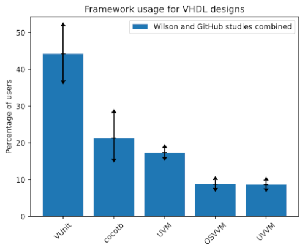

<!-- .slide: data-background="#145A32" -->

# FOSS for FPGA development

[github.com/rodrigomelo9/FOSS-for-FPGAs](https://github.com/rodrigomelo9/FOSS-for-FPGAs)

**Rodrigo A. Melo**, Unai Martinez-Corral

[Creative Commons Attribution 4.0 International](https://creativecommons.org/licenses/by/4.0/)

---
<!-- ###################################################################### -->
## Outline
<!-- ###################################################################### -->

* [Introduction](#/2)
* [Simulation](#/6)
* [Verification](#/10)
* [Implementation](#/15)
* [Development](#/23)
* [Hardware](#/31)
* [Final remarks](#/37)

---
<!-- ###################################################################### -->
## Introduction
<!-- .slide: data-background="#581845" -->
<!-- ###################################################################### -->

[⌂](#/1)

---

### What is FOSS?

* Free/Libre and Open Source Software
* Users have the freedom to **run**, **copy**, **distribute**, **study**, **change** and **improve** the software

|   |   |   |
|---|---|---|
|    |  |  |
|  |              |        |
|   |   |   |

---

### Why use FOSS?

* Freedom matters!
* Flexibility and Independence
* Knowledge sharing
* Innovation (*)
* Privacy and security
* And [several others](https://www.softwarefreedomday.org/about/why-foss)

(*) [Termux (Android) packages for EDA](https://github.com/hdl/Termux-packages)!

---

### Some previous considerations

* Most projects are *command-line* based (common on Linux/Unix, or you can use WSL2)
* Git is the prefered *Version Control System*, and most projects are in *GitHub* (some in *GitLab*)
* Containers (*Docker*, *Podman*) are commonly provided/employed (OS-level virtualization)
* *Continuous Integration* is almost mandatory
* Several projects employ and/or are based on *make/Makefiles* (build system)
* *Python* is frequently involved

----

#### Command-line

* Aka shell, terminal, console, bash...
* Most projects provide a CLI.
* Common on Linux/Unix distributions.
* Or use Windows Subsytem for Linux (WSL).

----

#### Git

* A distributed version control system.
* Created in 2005 by Linus Torvalds, for the development of the Linux kernel.
* De facto standard for FOSS projects.
* Allows dealing with a software repository and managing versions in multi-user workflows.

|   |   |   |
|---|---|---|
|  |  |  |
|   |   |   |

----

#### Docker

OS-level virtualization to deliver software in packages called **containers**.


Containers are isolated one from another and bundle their own software, libraries and configuration files.

----

#### Continuous Integration/Delivery/Deployment (CI/CD)

Automatically executing actions based on repository events (push, merge, cron, etc).

* **Integration:** run linters, unit and/or integration tests, Hardware-in-the loop simulation.
* **Delivery:** build binaries, documentation, packages, etc.
* **Deployment:** build and install in production.

----

#### Make

* A build automation tool: a Makefile contains a set of directives (targets, dependencies and rules) which are used by `make` for generating a target/goal.
* It works upon the principle that files only need to be recreated if their dependencies are newer than the file being re/created.
* There are newer alternatives (such as CMake, Scons, Ninja, etc.), but `make` is the most used automation tool in the FPGA ecosystem.

----

#### Python

* An interpreted, high-level and general-purpose programming language.
* One of the most used and fastest growing languages in all fields, especially in scientific computing and Machine/Deep Learning.
* Many of its libraries are written in C/C++ (performance).
* Most FOSS FPGA tools are written in Python, or C/C++ with a Python binding/wrapper.
* There are several HDL languages based on Python.
* It's also being used as a verification language.

---
<!-- ###################################################################### -->
## Simulation
<!-- .slide: data-background="#581845" -->
<!-- ###################################################################### -->

[⌂](#/1)

---

### VHDL simulator

|   |   |
|---|---|
|  | Analyzer, compiler, simulator and (experimental) synthesizer for VHDL |
|   |   |

* Full support for IEEE 1076 standard 1987, 1993, 2002 and partial for 2008.
* It can generate executable binary models of the VHDL design, for (co-)simulation.
* It can dump waveforms to multiple formats: VCD, FST or GHW (recommended for VHDL).

---

### Verilog simulators

|   |   |
|---|---|
|  | IEEE-1364 simulator</br>It generates an intermediate file format wich is then interpreted |
|   |   |

|   |   |
|---|---|
| Verilog/SystemVerilog simulator</br>Compiles into multithreaded C++</br>Performs lint code-quality checks |  |
|   |   |

---

### Waveform viewer

|   |   |
|---|---|
| A fully featured wave viewer which reads</br>LXT, LXT2, VZT, FST, and GHW files as</br>well as standard Verilog VCD/EVCD |  |
|   |   |

---
<!-- ###################################################################### -->
## Verification
<!-- .slide: data-background="#581845" -->
<!-- ###################################################################### -->

[⌂](#/1)

---

### HDL based frameworks/methodologies

* **OSVVM:** Open Source VHDL Verification Methodology
* **UVVM:** Universal VHDL Verification Methodology
* **SVUnit:** unit testing framework for Verilog/SystemVerilog

|   |   |   |
|---|---|---|
|  |  |  |
|   |   |   |

---

### Python aided framework


* **VUnit:** unit testing framework for VHDL/SystemVerilog.
* A Python build and simulator manager together with VHDL libraries.
* Supported simulators: GHDL, Aldec Riviera-PRO, Aldec Active-HDL, Mentor Questa, Mentor ModelSim, Cadence Incisive, Cadence Xcelium.

---

### Python based testbenches


cocotb is a COroutine based COsimulation TestBench environment for verifying VHDL and (System)Verilog RTL using Python

```
Supported simulators:
* GHDL, iverilog, verilator, Tachyon DA CVC.
* Synopsys VCS, Aldec Riviera-PRO & Active-HDL.
* Mentor Questa & ModelSim, Cadence Incisive & Xcelium.
```

[cocotb tutorial](cocotb.html)

---

### Formal verification

Using formal mathematic methods (assumptions and assertions) for proving the correctness of a design.

* **SymbiYosys (sby):** front-end driver program for Yosys-based formal verification flows.
* Supports Verilog (free), VHDL and SystemVerilog (through verific with a license).


(or try VHDL support trough ghdl-yosys-plugin)

---

### More info



**Source:** [GitHub Facts About the HDL Industry](https://larsasplund.github.io/github-facts)

**Read also:** [Open Source Verification Bundle (OSVB)](https://umarcor.github.io/osvb)

---
<!-- ###################################################################### -->
## Implementation
<!-- .slide: data-background="#581845" -->
<!-- ###################################################################### -->

[⌂](#/1)

---

### Overview


**Source:** [hdl/awesome#98](https://github.com/hdl/awesome/issues/98)

---

### Languages

|   |   |
|---|---|
|    | Amaranth (nMigen), MyHDL     |
|      | SpinalHDL, Chisel            |
|  | Clash, Bluespec              |
| Others                               | Silice, PipelineC, and more! |
|   |   |

---

### Synthesis: Yosys

* A FOSS framework for RTL synthesis tools.
* It currently has extensive Verilog-2005 support and provides a basic set of synthesis algorithms for various application domains.
* It was the first usable FOSS synthesizer targeting commercially available devices.
* Supports devices from Lattice (iCE40 and ECP5), Xilinx (Series 7, Ultrascale, and others), Gowin, Achronix, Intel, Microsemi, etc.


---

### Synthesis: GHDL

* Analyzer, compiler, simulator and (experimental) synthesizer for VHDL
* Generates a generic (technology independent) synthesized VHDL (and recently, also Verilog)

* **ghdl-yosys-plugin:** VHDL synthesis, based on GHDL and Yosys.


---

### Place & Route


* NextPnR (Arachne-pnr)
* VPR, part of Verilog-to-Routing (VTR)

---

### Bitstream Generation


<!--http://www.fabienm.eu/flf/materiel/liberation-des-fpga/-->

---

### Programming

* **OpenOCD:** **Open** **O**n-**C**hip **D**ebugging, In-System Programming and Boundary-Scan Testing
* **UrJTAG:** universal JTAG library, server and tools
* **iceprog:** programmer of the IceStorm project (FTDI-based programmers)
* **ecpprog:** programmer for the Lattice ECP5 series  (FTDI-based programmers)
* **openFPGALoader:** universal utility for programming FPGA
* **dfu-util:** **D**evice **F**irmware **U**pgrade **Uti**lities (USB)

---
<!-- ###################################################################### -->
## Development
<!-- .slide: data-background="#581845" -->
<!-- ###################################################################### -->

[⌂](#/1)

---

### Project Managers

* **edalize:** a Python Library for interacting with EDA tools (was part of FuseSoC, now its build backend).
* **HDLmake:** tool for generating multi-purpose Makefiles for FPGA projects (CERN)
* **PyFPGA:** A Python package to use FPGA development tools programmatically

|   |   |   |   |
|---|---|---|---|
|  | Synthesis</br>Implementation</br>Bitstream</br>Programming | ISE, Vivado</br>Quartus</br>Libero-SoC</br>FOSS | **Helpers**</br>hdl2bit</br>prj2bit</br>bitprog |
|   |   |   |   |

---

### Libraries, Collections, IP Cores

* **PoC (Pile of Cores Library):** a library of free, open-source and platform independent IP cores.
* **FuseSoC:** package manager and build abstraction tool (edalize) for FPGA/ASIC development.
* **Litex:** a Migen/MiSoC based SoC builder to easily create Cores/SoCs
* **OpenCores** and **LibreCores:** collections of IPs.
* Several FOSS projects at GitHub and GitLab.

&nbsp;&nbsp;&nbsp;&nbsp;&nbsp;&nbsp;&nbsp;&nbsp;

---

### Softcores: Legacy

**Leon 3** (Gaisler)
* 32-bit VHDL processor compliant with the SPARC V8 architecture
* GNU GPL license for research and education
* Part of the GRLIB

**OpenRISC**
* Specification OpenRISC 1000 (32/64 bits)
* The flagship implementation, the OR1200, is written in Verilog
* Part of OpenRISC Reference Platform SoC

---

### Softcores: RISC V


---

### TerosHDL (VScode plugin)


Suports GHDL, Yosys, VUnit, GTKwave, Verilator, cocotb, edalize, icestorm, Trellis, Symbiflow...

---

### System Verilog Support

* UHDM: Universal Hardware Data Model
* Surelog: SystemVerilog 2017 Pre-processor, Parser, Elaborator, UHDM Compiler (work in progress to integrate with Yosys and Verilator)
* Verible: SystemVerilog 2017 parser for developer tools (linter, formatter, indexer, lexical diff, others)

&nbsp;&nbsp;&nbsp;&nbsp;

---
<!-- ###################################################################### -->
## Hardware
<!-- .slide: data-background="#581845" -->
<!-- ###################################################################### -->

[⌂](#/1)

---

### Kicad


---

### Some ICE40 based boards

|     |     |     |
|:---:|:---:|:---:|
| Fomu</br> | iCEBreaker</br> | iCESugar</br> |

|     |     |
|:---:|:---:|
| TinyFPGA BX</br> | EDU CIAA FPGA</br> |

---

### Some ECP5 based boards

|     |     |     |
|:---:|:---:|:---:|
| ULX3S</br> |OrangeCrab</br> | TinyFPGA EX</br> |
|     |     |     |

---

### Some EOS S3 based boards

|     |     |
|:---:|:---:|
| Qomu</br> | Quickfeather</br> |
|     |     |

---
<!-- ###################################################################### -->
## Final remarks
<!-- .slide: data-background="#581845" -->
<!-- ###################################################################### -->

[⌂](#/1)

---

### How to get the tools

* From the system package manager (not always an option and generally outdated)
* From the project repository (some times could be complex or tedious)
* Get a ready to use container from [hdl.github.io/containers](https://hdl.github.io/containers/)
  (install [Docker](https://github.com/rodrigomelo9/FOSS-for-FPGAs#docker-installation))
* Use a package manager for Windows ([MSYS2](https://www.msys2.org/)) and install from [hdl.github.io/MINGW-packages](https://hdl.github.io/MINGW-packages/)

---

### How to be updated: Projects - Organizations

&nbsp;&nbsp;&nbsp;&nbsp;

&nbsp;&nbsp;&nbsp;&nbsp;

&nbsp;&nbsp;&nbsp;&nbsp;

---

### Why to produce FOSS?

Your reasons here.

---
<!-- ###################################################################### -->
# Questions?
<!-- .slide: data-background="#1F618D" -->
<!-- ###################################################################### -->

|   |   |
|---|---|
|  | [rodrigomelo9](https://github.com/rodrigomelo9) |
|  | [rodrigomelo9ok](https://twitter.com/rodrigomelo9ok) |
|  | [rodrigoalejandromelo](https://www.linkedin.com/in/rodrigoalejandromelo/) |
|   |   |
